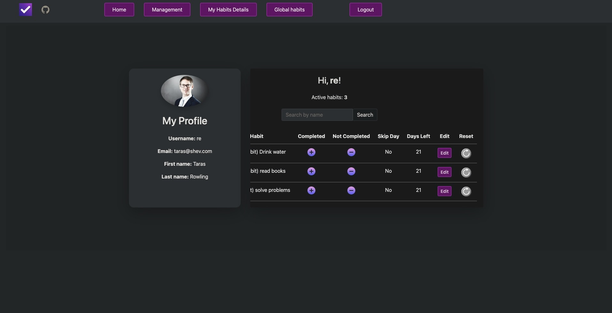
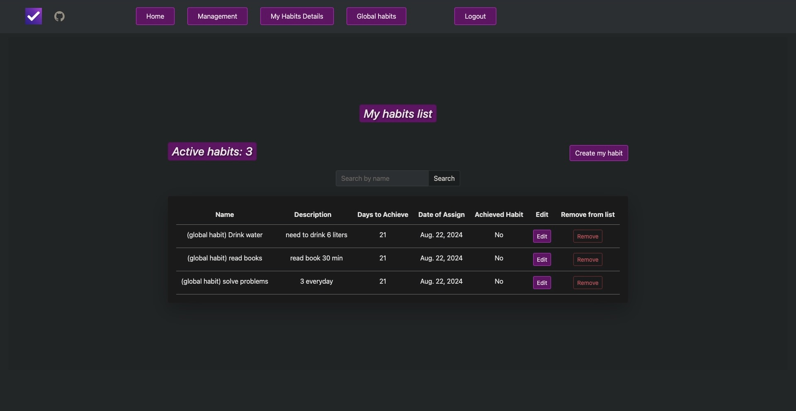
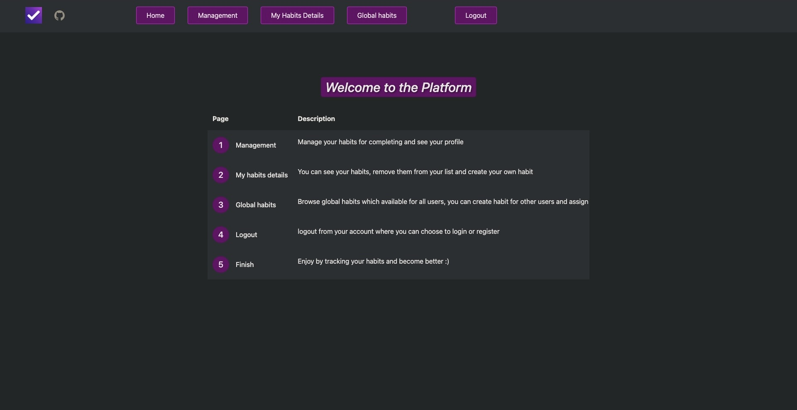
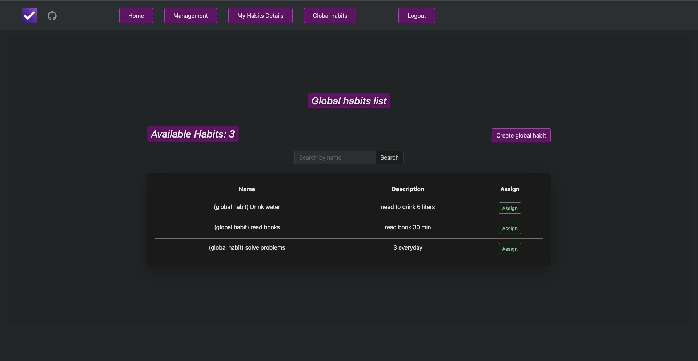

# Habit-Tracker

## Description
This project about managing your and global habits.
You can create your own habit which will be able only for you and global habit which will be able for all users.
Every day you need to press buttons that you completed or not completed habit today.
You will need 21 days by default to consolidate the habit, also you can set your own value.

## Installation
```
git clone git@github.com:Unlie9/habit-tracker.git
cd habit-tracker
python -m venv venv
pip install requirements.txt
python manage.py runserver
```

## Deploy url
https://habit-tracker-43jt.onrender.com/

- Login Data
- User: "Unlie9"
- Password: "12344321Qz"

## Interface





